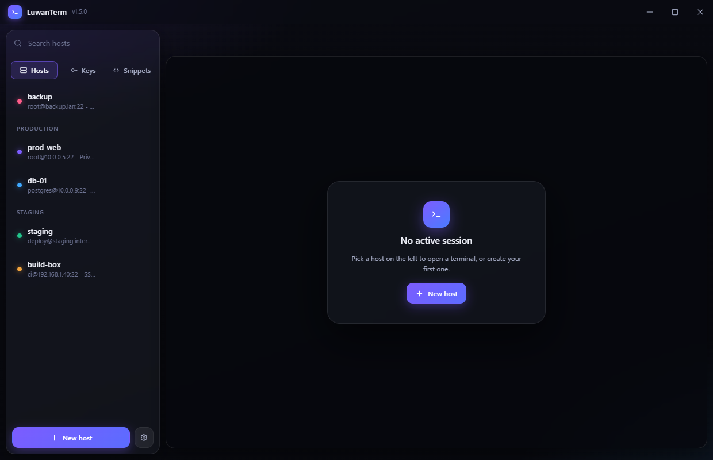

<div align="center">


# LuwanTerm

A clean SSH client for Windows — tabbed terminals, SFTP, and port forwarding in one window.

<!-- badges -->


[](https://github.com/Rathio12/LuwanTerm/tree/main/test)
[](https://github.com/Rathio12/LuwanTerm)
[](https://github.com/Rathio12/LuwanTerm/releases/latest)
[](https://github.com/Rathio12/LuwanTerm/releases)
[](https://github.com/Rathio12/LuwanTerm/actions/workflows/ci.yml)
<!-- /badges -->


</div>

<div align="center">
  
</div>

## What it does

- **Terminals** — tabbed sessions on xterm.js with GPU rendering, a find bar, and copy-on-select.
- **Hosts** — profiles with groups, accent colours, keepalive, and a command to run on connect.
- **Keys** — generate Ed25519 / RSA / ECDSA pairs, use keys you already have, or install a public key on a server for you.
- **PuTTY `.ppk` files work directly** — v2 and v3, every key type, encrypted or not. Read where they live, never converted or rewritten.
- **SFTP** — browse, upload, download whole folders, rename, delete, with live progress and cancellable transfers.
- **Tunnels** — local (`-L`), remote (`-R`), and dynamic SOCKS5 (`-D`) forwarding.
- **Host key pinning** — fingerprints recorded on first use and checked every time, with a loud warning if one changes.
- **Make it yours** — pick from every monospace font you have installed (previewed in its own face), set an accent colour, and put an image behind the interface.
- **Updates itself** — checks GitHub releases, downloads in the background, offers a restart.
- **Secrets in the OS keychain** — never written to disk in the clear. If the platform can't encrypt, nothing is stored at all.

## Try it without installing

The [website](https://rathio12.github.io/LuwanTerm/) has a working copy of the
interface: change the font, the size, the accent and the terminal opacity, and
watch it apply. The font list below it runs the same check the app does to find
what you have installed, then loads the rest from Google Fonts - **click any
font in that list and the demo switches to it.**

## Quick start

```bash
npm install
npm start
```

Or grab a build:

```bash
npm run dist     # installer + portable exe in dist/
```

## Contributing and security

[SECURITY.md](SECURITY.md) is worth a read before trusting this with real
credentials — it is honest about the limits as well as the protections.
[CONTRIBUTING.md](CONTRIBUTING.md) covers setup and house style, and
[CHANGELOG.md](CHANGELOG.md) tracks what changed.

## Documentation

Everything lives in **[guides/](guides/)**:

| Guide | What's in it |
| --- | --- |
| [Getting started](guides/getting-started.md) | First connection, hosts, tabs, shortcuts |
| [SSH keys](guides/keys.md) | Generating, adding your own, `.ppk`, installing on a server |
| [SFTP](guides/sftp.md) | Transferring files, folder downloads, cancelling |
| [Tunnels](guides/tunnels.md) | Local, remote and SOCKS5 forwarding with worked examples |
| [Configuration](guides/configuration.md) | `.env` build settings versus user settings |
| [Building](guides/building.md) | Installer, portable, icon, the build config |
| [Code signing](guides/signing.md) | Why Windows complains and what actually fixes it |
| [Discord presence](guides/discord.md) | Turning it on, and what it does and doesn't reveal |
| [Make it your own](guides/customising.md) | Rebranding, retheming, adding a panel or an IPC call |
| [Architecture](guides/architecture.md) | How the pieces fit, for anyone changing the code |

## Built on

[Electron](https://electronjs.org) · [ssh2](https://github.com/mscdex/ssh2) · [xterm.js](https://xtermjs.org) — no bundler, no framework, plain modules.

## Licence

UNLICENSED — private project.
