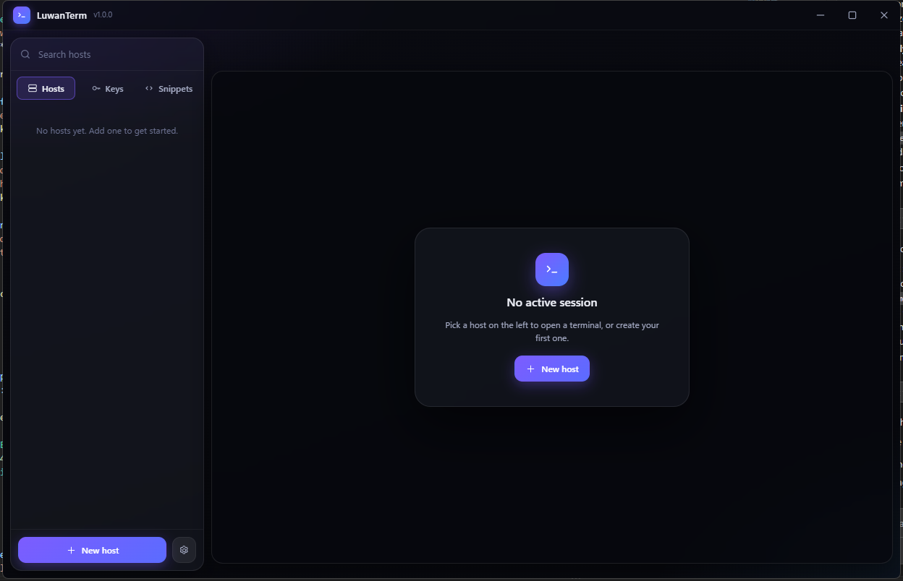

<div align="center">


# LuwanTerm

A clean SSH client for Windows — tabbed terminals, SFTP, and port forwarding in one window.

</div>

<div align="center">
  
</div>

## What it does

- **Terminals** — tabbed sessions on xterm.js with GPU rendering, a find bar, and copy-on-select.
- **Hosts** — profiles with groups, accent colours, keepalive, and a command to run on connect.
- **Keys** — generate Ed25519 / RSA / ECDSA pairs, use keys you already have, or install a public key on a server for you.
- **PuTTY `.ppk` files work directly** — v2 and v3, every key type, encrypted or not. Read where they live, never converted or rewritten.
- **SFTP** — browse, upload, download whole folders, rename, delete, with live progress and cancellable transfers.
- **Tunnels** — local (`-L`), remote (`-R`), and dynamic SOCKS5 (`-D`) forwarding.
- **Host key pinning** — fingerprints recorded on first use and checked every time, with a loud warning if one changes.
- **Secrets in the OS keychain** — never written to disk in the clear. If the platform can't encrypt, nothing is stored at all.

## Quick start

```bash
npm install
npm start
```

Or grab a build:

```bash
npm run dist     # installer + portable exe in dist/
```

## Documentation

Everything lives in **[docs/](docs/)**:

| Guide | What's in it |
| --- | --- |
| [Getting started](docs/getting-started.md) | First connection, hosts, tabs, shortcuts |
| [SSH keys](docs/keys.md) | Generating, adding your own, `.ppk`, installing on a server |
| [SFTP](docs/sftp.md) | Transferring files, folder downloads, cancelling |
| [Tunnels](docs/tunnels.md) | Local, remote and SOCKS5 forwarding with worked examples |
| [Building](docs/building.md) | Installer, portable, icon, the build config |
| [Code signing](docs/signing.md) | Why Windows complains and what actually fixes it |
| [Discord presence](docs/discord.md) | Turning it on, and what it does and doesn't reveal |
| [Make it your own](docs/customising.md) | Rebranding, retheming, adding a panel or an IPC call |
| [Architecture](docs/architecture.md) | How the pieces fit, for anyone changing the code |

## Built on

[Electron](https://electronjs.org) · [ssh2](https://github.com/mscdex/ssh2) · [xterm.js](https://xtermjs.org) — no bundler, no framework, plain modules.

## Licence

UNLICENSED — private project.
