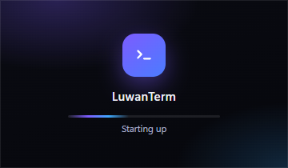

# Discord Rich Presence

<div align="center">
  
</div>

Shows LuwanTerm on your Discord profile while it's running.

## What it shows

```
LuwanTerm
3 sessions
```

**It does not show host names.** An SSH client announcing which machines you're
logged into is a genuine leak — Discord sees it, and so does anyone who can view
your profile. There's a separate tick box if you want host names anyway, off by
default.

## Setting it up

It ships enabled with an application id already configured, so it should just
work. To point it at your own Discord application instead:

1. Create an application at
   [discord.com/developers/applications](https://discord.com/developers/applications).
2. Copy the **Application ID**.
3. Under **Rich Presence → Art Assets**, upload an image named `icon` — without
   it the presence shows with no artwork.
4. In LuwanTerm: **Settings → Discord Rich Presence**, paste the id.

## Settings

| Setting | Default | What it does |
| --- | --- | --- |
| Show LuwanTerm on your Discord profile | on | Master switch |
| Discord application ID | preset | Which Discord app the presence belongs to |
| Include the host name | **off** | Shows which machine you're on. Think before enabling |

Changes apply immediately — no restart.

## How it works

Implemented directly against Discord's IPC protocol in
[`src/main/discord.js`](../src/main/discord.js): a 4-byte opcode, a 4-byte
little-endian length, then JSON, over a local named pipe. There is **no
dependency** on the `discord-rpc` package, which is unmaintained.

Every path is fail-safe. Discord closed, never installed, or dropping the
connection all end in silence — it retries quietly in the background and never
delays or crashes the app.

## If nothing shows up

- Discord must be **running**, and the desktop app — the web client has no local
  socket to talk to.
- Check the application ID matches a real application you own.
- Discord hides your own activity from you in some views; check how your profile
  looks to someone else.
- Game Activity must not be disabled in Discord's privacy settings.
