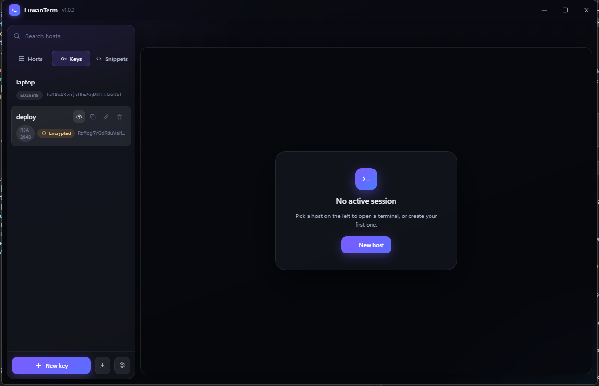

# SSH keys

<div align="center">
  
</div>

The **Keys** tab is where every key the app knows about lives. Nothing appears
here on its own — keys are only ever added because you asked.

## Three kinds of key

| Kind | Where the file lives | Deleting it in the app |
| --- | --- | --- |
| **Generated** | The app's own data folder, owner-only permissions | Erases the file |
| **Linked** | Wherever it already was | Forgets the path, leaves your file alone |
| **Found** | Wherever it already was | Same — it's your file |

The app never deletes a file it did not create.

## Generating a key

**New key** → pick a type:

- **Ed25519** — the right default. Small, fast, modern.
- **RSA** — 4096/3072/2048, for older servers that reject Ed25519.
- **ECDSA** — 256/384/521.

A passphrase is optional but recommended; tick the box to keep it in the OS
keychain so you aren't asked every time. The private key is written to the app's
data folder and only its public half ever leaves the machine.

## Using keys you already have

The **add key** button (next to *New key*) offers two routes:

- **Browse for a file** — point at any private key.
- **Find keys on this PC** — scans `~/.ssh` and PuTTY's saved sessions and shows
  you what it found. Tick the ones you want. **Nothing is added until you pick
  it.**

Either way the default is to *link* the file — the app remembers the path and
reads it where it sits, so you can use as many existing keys as you like without
moving any of them. Tick **Copy the key into LuwanTerm** if you'd rather it kept
its own copy.

An encrypted key can be added without unlocking it. Its public half is read from
the `.ppk` itself or a sibling `.pub` file, and the passphrase is asked for when
you first connect.

## PuTTY `.ppk` files

They work directly — **version 2 and version 3, every key type, encrypted or
not.** Point at a `.ppk` and use it.

Encrypted version 3 files use Argon2, which the app gets from the Node that
Electron bundles, so a released build always has it. Only a source checkout on
Node older than 24 would not, and it says so plainly rather than failing
obscurely.

Nothing is converted. The file stays a `.ppk` and is never rewritten. When you
connect, the key is decoded in memory into the form the SSH layer expects, and
the passphrase is consumed there rather than being handed on.

This is worth spelling out because the library underneath (`ssh2`) only supports
PPK v2 with RSA/DSS keys, and PuTTY has written v3 by default since 0.75 — so
LuwanTerm carries its own parser in
[`src/main/ssh/ppk.js`](../src/main/ssh/ppk.js).

## Installing a key on a server

Connect to the server with a password first, then in the Keys tab click the
**install** button on the key. Pick the session and confirm.

It does what `ssh-copy-id` does:

```sh
mkdir -p ~/.ssh
chmod 700 ~/.ssh
touch ~/.ssh/authorized_keys
chmod 600 ~/.ssh/authorized_keys
# appends the key only if it isn't already there
```

Running it twice is harmless — it detects the key is already authorised. Then
edit the host, switch it to **Private key**, and pick the key.

## Copying a public key by hand

Click a key, then **Copy public key**, and paste it into
`~/.ssh/authorized_keys` on the server yourself. The details dialog also shows
the full line and the SHA256 fingerprint.

## SSH agent

If you'd rather let an agent hold your keys, set a host's authentication to
**SSH agent**. On Windows that's the `openssh-ssh-agent` pipe or Pageant,
whichever is running; elsewhere it follows `SSH_AUTH_SOCK`.
